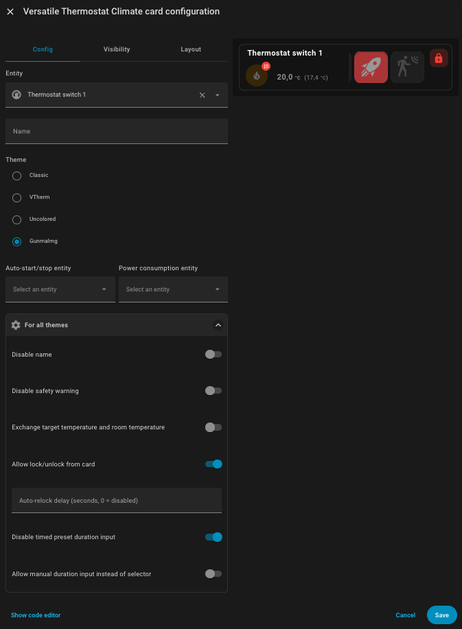
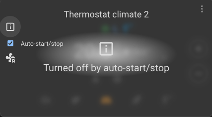
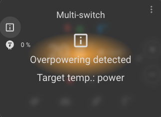
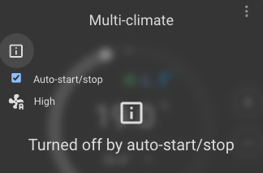
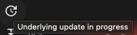
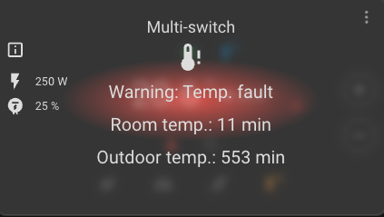
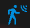
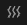
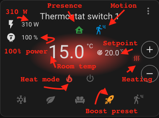

[![GitHub Release][releases-shield]][releases]
[![GitHub Activity][commits-shield]][commits]
[![License][license-shield]](LICENSE)
[![hacs][hacs_badge]][hacs]
[![BuyMeCoffee][buymecoffeebadge]][buymecoffee]


> This card need a "real" front UI developer. If you have time and skill, please contact me. Many issues are related to the front UI.

- [UI Card for Versatile Thermostat](#ui-card-for-versatile-thermostat)
  - [Goals](#goals)
- [Installation](#installation)
  - [Options](#options)
- [Actions](#actions)
  - [Disable the auto-fan mode](#disable-the-auto-fan-mode)
  - [By-pass the window detection](#by-pass-the-window-detection)
  - [Lock/Unlock the thermostat](#lockunlock-the-thermostat)
- [Informations on current state](#informations-on-current-state)
  - [Display some messages](#display-some-messages)
  - [Update of underlying scheduled](#update-of-underlying-scheduled)
  - [Safety state](#safety-state)
  - [Icons used](#icons-used)
  - [Help wanted!](#help-wanted)
  - [Translations](#translations)
  - [Support me](#support-me)


# UI Card for Versatile Thermostat 

>  This card is dedicated to the Versatile Thermostat integration which is available in HACS also and [here](https://github.com/jmcollin78/versatile_thermostat).
> 
> This card is based on the beautiful [Better Thermostat UI Card](https://github.com/KartoffelToby/better-thermostat-ui-card). It adds some feature so that you can use Versatile Thermostat directly from the card. A big thanks to @KartoffelToby for this Better Thermostat UI Card.

Notes:
1. The VTherm should be in V8.x or above to work well with this version.
2. Only VTherm climate entities will have a correct display with this card. Other climate should work rougthly

When presence is detected:


When safety is detected:


When activity is detected:


When overpowering is detected:


When window open is detected:


When window bypass is activated:


With all status icons:


The card configuration:


 
## Goals

- [X] Add versatile_thermostat support for showing the extra status
- [X] Improve the UI for Touch devices

# Installation

For installation you should have [HACS](https://hacs.xyz/docs/setup/download/) installed. Then add this repository https://github.com/jmcollin78/versatile-thermostat-ui-card in HACS and install the card. You have to reload you browser after installation.

Then you can add the new card into your dashboard.

## Options

Note: those options should be improved with official release
| Name                 | Type    | Default      | Description                                                                                            |
| -------------------- | ------- | ------------ | ------------------------------------------------------------------------------------------------------ |
| type                 | string  | **Required** | `custom:versatile-thermostat-ui-card`                                                                     |
| entity               | string  | **Required** | The entity id of climate entity (must be a versatile_thermostat entity). Example: `climate.hvac`          |
| name                | string/boolean  | **optional** | override the default entity name |
| disable_name        | boolean  | **optional** | true to hide the name                                                                     |
| disable_circle        | boolean  | **optional** | true to hide the circle for setpoint. If no checked, an colored ellipse on the background is displayed instead. This option save space                                                                     |
| disable_window       | boolean  | **optional** | turn off the window open indicator                                                                     |
| disable_overpowering | boolean  | **optional** | turn off the overpowering indicator                                                                |
| disable_heat        | boolean  | **optional** | turn off the on/heat button                                                                          |
| disable_cool        | boolean  | **optional** | turn off the on/cool button                                                                          |
| disable_heat_cool   | boolean  | **optional** | turn off the on/heat_cool button                                                                     |
| disable_auto        | boolean  | **optional** | turn off the on/auto button                                                                          |
| disable_dry         | boolean  | **optional** | turn off the on/dry button                                                                           |
| disable_fan_only    | boolean  | **optional** | turn off the on/fan_only button                                                                      |
| disable_off         | boolean  | **optional** | turn off the off button                                                                         |
| disable_sleep_mode     | boolean  | **optional** | turn off the sleep mode button                                                                        |
| disable_buttons     | boolean  | **optional** | turn off the plus/minus buttons                                                                        |
| disable_safety_warning     | boolean  | **optional** | turn off the security warning (when a temperature sensor is out)                              |
| disable_power_infos | boolean  | **optional** | turn off the power informations                                                                        |
| disable_auto_fan_infos | boolean  | **optional** | turn off the auto-fan informations                                                                  |
| disable_target_icon | boolean  | **optional** | hide the target icon for the setpoint temperature (which can be confusing with the room temperature) |
| set_current_as_main | boolean | **optional** | Exchange target temperature and room temperature |
| autoStartStopEnableEntity               | string  | **Optional** | The entity id of auto-start/stop entity (must be a switch entity). Example: `switch.clim_salon_auto_start_stop`          |
| powerEntity               | string  | **Optional** | The entity id of sensor entity which gives the real power consumed by the VTherm. Example: `sensor.clim_salon_power`          |
| allow_lock_toggle         | boolean | **Optional** | true to display a lock icon to lock/unlock the thermostat. If a code is configured in VTherm, a keypad will be displayed. |


Example:
```
type: custom:versatile-thermostat-ui-card
entity: climate.multi_climate
set_current_as_main: true
disable_circle: true
disable_menu: true
autoStartStopEnableEntity: switch.multi_climate_enable_auto_start_stop
powerEntity: sensor.multi_climate_power
```



# Actions
Some actions are available directly on the card.

## Disable the auto-fan mode
For `over_climate` you have the possibility to configure the `auto-fan` mode feature. See [versatile_thermostat README](https://github.com/jmcollin78/versatile_thermostat/blob/main/README.md#auto-fan-mode).

If the `auto-fan` mode is configured, you can toggle between the configured `auto_fan_mode` configured for the VTherm and the None mode (which disable the auto-fan mode).

To toggle the auto-fan mode you must:
1. click on the `Auto-fan` icon at the left of the Thermostat.

## By-pass the window detection

If an open window has been detected, you want to bypass it by clicking on the window icon (above the temperatures). This will enable the window by-pass and then disable the window detection impact. Notice that the icon change to this one when the by-pass is set: 

## Lock/Unlock the thermostat

You can lock or unlock the thermostat by clicking on the lock icon at the top right of the card.
If a pincode is configured in the Versatile Thermostat integration, a keypad dialog will appear to enter the code.
This requires the `allow_lock_toggle` option to be set to `true` in the card configuration.

# Informations on current state

## Display some messages
When the mode or the preset or the target temperature has been changed due to special event (window detection, motion detection, power, ...) an information icon like  is diplayed on the left bar.
Click on it and you will see why your VTherm is not in the requested state.

Example when the setpoint has been changed due to motion detection:

  

Another example when the VTherm has been turned off by the auto-start/stop feature:

  

When overpowering and shedding is activated and the setpooint has been set with the `power_temp` configuration value:

  

If the VTherm has been turned off by the auto-start/stop feature:

  

Just click another time to the information icon to close the information popup.

## Update of underlying scheduled
When the update of the underlying has been delayed due to temporal filter (see on VTherm documentation), then an update icon will be displayed in the left bar:



## Safety state
The safety state informs you that one off the temperature sensors configured in your VTherm don't have send any new temperature to your VTherm. When this happens, there is a risk of overheating and then the VTherm turns into the safety state. This is displayed like that:



The safety mode has been activated because the outdoor temperature sensor's last measurement was 554 minutes ago (and the room temperature was 13 min ago which is more normal).

More informations on the safety mode can be found [here](https://github.com/jmcollin78/versatile_thermostat/blob/main/documentation/en/troubleshooting.md#why-is-my-versatile-thermostat-going-into-safety-mode).

## Icons used

| Icon  | Meaning  |
|---|---|
|   | Some information messages are available. Click on it to see it  |
|   | The underlying device's update has been delayed. See temporal filter on VTherm documentation  |
|   | The presence is detected  |
|   | The activity (ie motion) is detected  |
|   | The window is detected as open. Click on it to bypass the window detection  |
|   | The window bypass is active. Click on it to cancel the bypass |
|   | An overpowering detection has been done. The VTherm is in shedding mode |
|   | The VTherm has been turned off by the auto-start/stop feature. |
|   | The target temperature (setpoint)  |
|    | The underlying device is cooling (`hvac_action` is cooling)  |
|    | The underlying device is idle and the mode is Cool (`hvac_action` is idle and the `hvac_mode` is Cool)  |
|    | The underlying device is heating (`hvac_action` is heating)  |
|    | The underlying device is idle and the mode is Heat (`hvac_action` is idle and the `hvac_mode` is Heat)  |

Example:

  

## Help wanted!

It would be awsome if you help me to translate this card to other languages.

Create a PR, the Translation is done in json files checkout the en translation [here](https://github.com/KartoffelToby/versatile-thermostat-ui-card/blob/master/src/localize/languages/en.json)

Please add your language to this list as well while you are making your PR. Put it in alphabetical order and according to [ISO 639-1](https://en.wikipedia.org/wiki/List_of_ISO_639-1_codes).

## Translations

[INLANG Editor](https://inlang.com/editor/github.com/KartoffelToby/versatile-thermostat-ui-card)

What we have so far:
- en - Reference 
- bg
- ca
- cn
- cs
- da
- de
- el
- es
- fi
- fr - Reference
- hu
- it
- nl
- no
- pl
- pt
- ro
- ru
- sv
- sl
- sk
- tr
- uk

## Support me
<a href="https://www.buymeacoffee.com/jmcollin78"></a>

***

[versatile_thermostat]: https://github.com/jmcollin78/versatile_thermostat
[buymecoffee]: https://www.buymeacoffee.com/jmcollin78
[buymecoffeebadge]: https://img.shields.io/badge/Buy%20me%20a%20beer-%245-orange?style=for-the-badge&logo=buy-me-a-beer
[commits-shield]: https://img.shields.io/github/commit-activity/y/jmcollin78/versatile-thermostat-ui-card.svg?style=for-the-badge
[commits]: https://github.com/jmcollin78/versatile-thermostat-ui-card/commits/master
[hacs]: https://github.com/custom-components/hacs
[hacs_badge]: https://img.shields.io/badge/HACS-Custom-41BDF5.svg?style=for-the-badge
[forum-shield]: https://img.shields.io/badge/community-forum-brightgreen.svg?style=for-the-badge
[forum]: https://community.home-assistant.io/
[license-shield]: https://img.shields.io/github/license/jmcollin78/versatile-thermostat-ui-card.svg?style=for-the-badge
[maintenance-shield]: https://img.shields.io/badge/maintainer-Joakim%20Sørensen%20%40ludeeus-blue.svg?style=for-the-badge
[releases-shield]: https://img.shields.io/github/release/jmcollin78/versatile-thermostat-ui-card.svg?style=for-the-badge
[releases]: https://github.com/jmcollin78/versatile-thermostat-ui-card/releases
