[![GitHub Release][releases-shield]][releases]
[![GitHub Activity][commits-shield]][commits]
[![License][license-shield]](LICENSE)
[![hacs][hacs_badge]][hacs]
[![BuyMeCoffee][buymecoffeebadge]][buymecoffee]


- [Upgrading to v3](#upgrading-to-v3)
- [UI Card for Versatile Thermostat](#ui-card-for-versatile-thermostat)
  - [Goals](#goals)
  - [Theme management](#theme-management)
    - [The "Classical theme"](#the-classical-theme)
    - [The "VTherm theme"](#the-vtherm-theme)
    - [The "VTherm Uncolored theme"](#the-vtherm-uncolored-theme)
    - [The "Gunmalmg theme"](#the-gunmalmg-theme)
      - [Preset display](#preset-display)
      - [Lock and timed preset controls](#lock-and-timed-preset-controls)
      - [Popup](#popup)
      - [Warning and safety display](#warning-and-safety-display)
      - [Applicable options](#applicable-options)
- [Installation](#installation)
  - [Options](#options)
    - [Common options (all themes)](#common-options-all-themes)
    - [Classical, VTherm and Uncolored themes only](#classical-vtherm-and-uncolored-themes-only)
- [Actions](#actions)
  - [Disable the auto-fan mode](#disable-the-auto-fan-mode)
  - [By-pass the window detection](#by-pass-the-window-detection)
  - [Lock/Unlock the thermostat](#lockunlock-the-thermostat)
  - [Timed preset](#timed-preset)
    - [How to use](#how-to-use)
    - [When a timed preset is active](#when-a-timed-preset-is-active)
    - [Configuration options](#configuration-options)
  - [Modify preset temperatures](#modify-preset-temperatures)
    - [How it works](#how-it-works)
    - [The temperature table](#the-temperature-table)
    - [The stepper input](#the-stepper-input)
    - [Entity discovery](#entity-discovery)
  - [Regulation chart](#regulation-chart)
    - [Displayed curves](#displayed-curves)
    - [Navigation](#navigation)
    - [Configuration](#configuration)
- [Informations on current state](#informations-on-current-state)
  - [Display some messages](#display-some-messages)
  - [Update of underlying scheduled](#update-of-underlying-scheduled)
  - [Safety state](#safety-state)
  - [Icons used](#icons-used)
  - [Help wanted!](#help-wanted)
  - [Translations](#translations)
  - [Support me](#support-me)


# Upgrading to v3

> **⚠️ Important:** Version 3 introduces breaking changes to the card configuration. After upgrading, please review and update your card options.

**What changed:**
- The **[Gunmalmg theme](#the-gunmalmg-theme)** has been **completely redesigned** with a new condensed layout, preset scrollable row, lock/timed preset controls, a detailed popup, and warning/safety visual indicators. See the [Gunmalmg theme section](#the-gunmalmg-theme) for full details.
- **Configuration options have been reorganized** into two sections: [Common options (all themes)](#common-options-all-themes) and [Classical, VTherm and Uncolored themes only](#classical-vtherm-and-uncolored-themes-only). Some options that were previously available are no longer applicable to the Gunmalmg theme.
- **Obsolete options removed:** `disable_circle` and `disable_background_color` are no longer supported (they are now enforced by the selected theme).
- **Unused option removed:** `eco_temperature` has been removed.

**What you should do:**
1. Open each card configuration that uses this card.
2. Check that your options are still valid — unused or obsolete options will be silently ignored but should be cleaned up to be able to use the UI configuration window.
3. If you use the Gunmalmg theme, review the [applicable options](#applicable-options) to see which settings are supported.

# UI Card for Versatile Thermostat 

>  This card is dedicated to the Versatile Thermostat integration which is available in HACS also and [here](https://github.com/jmcollin78/versatile_thermostat).
> 
> This card is based on the beautiful [Better Thermostat UI Card](https://github.com/KartoffelToby/better-thermostat-ui-card). It adds some feature so that you can use Versatile Thermostat directly from the card. A big thanks to @KartoffelToby for this Better Thermostat UI Card.

Notes:
1. The VTherm should be in V8.x or above to work well with this version.
2. Only VTherm climate entities will have a correct display with this card. Other climate should work rougthly

When presence is detected:


When safety is detected:


When activity is detected:


When overpowering is detected:


When window open is detected:


When window bypass is activated:


With all status icons:


The card configuration:

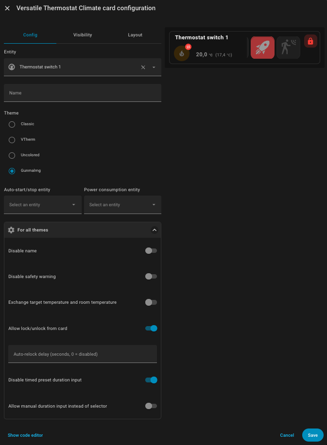

## Goals

- [X] Add versatile_thermostat support for showing the extra status
- [X] Improve the UI for Touch devices

## Theme management

The 2.3 release adds a theme management option

### The "Classical theme"

The classical theme with the temperature selection circle and all _VTherm_ specificities displayed.


### The "VTherm theme"

The VTherm theme is a full featured theme but more concise than the classical. All _VTherm_'s specificities are displayed in a smaller card. Basically it removes the big colored circle that takes place and add a colored ellipse in background allowing you to see immediatly the state of the thermostat.


### The "VTherm Uncolored theme"

Juste like the _VTherm_ theme but without the colored ellipse in background.


### The "Gunmalmg theme"

Inspired by the card developed by @Gunmalmg (see [here](https://github.com/jmcollin78/versatile_thermostat/issues/354#issuecomment-1961050097)), this theme is a **minimal, condensed theme** designed to be easily readable even from a distance.


**Displayed information:**
- Current temperature (`current_temperature`)
- Target temperature (`target_temperature`)
- HVAC mode (`hvac_mode`)
- HVAC action (`hvac_action`)
- Lock state (`lock_state`)
- Selected preset (`preset_mode`)
- Timed preset (`timed_preset`)

**Available actions from the card:**
1. Turn on / turn off the thermostat (hvac_mode)
2. Change the preset (preset_mode)
3. Toggle the lock state
4. Activate / deactivate the timed preset
5. Open a detailed popup by clicking on a temperature

#### Preset display

Presets are displayed as buttons on a single horizontally scrollable row. The active preset is highlighted with a colored background, while other presets have a neutral (greyed) background. The scrollable area automatically scrolls to the active preset when the card is displayed.

#### Lock and timed preset controls

The lock and timed preset controls are displayed as buttons to the right of the preset buttons.

- The **lock button** is displayed at the top-right, vertically aligned with the preset buttons. When the lock is active, the button is displayed in **red**; otherwise it is displayed in **green**. The lock button can be completely hidden via the `allow_lock_toggle` option.
- The **timed preset** controls work identically to the other themes (duration selector or manual input), but are positioned next to the preset buttons instead of below them.

#### Popup

Clicking on a temperature opens a **popup** that displays the same detailed information as the Classical theme. The popup reuses the Classical theme code directly (no duplication).

- The popup is **centered** on the screen.
- On mobile, it can take the full page; on desktop, it is smaller but always easily readable.
- A **close button** is available at the top-left corner (like standard Home Assistant popups).

#### Warning and safety display

If a warning message is present or if the thermostat is in **safety mode**, the main temperature is displayed in **red** to draw the user's attention. Clicking on it opens the popup with the warning/safety message already visible, as if the user had clicked on the red information icon.

#### Applicable options

Only the following options apply to the Gunmalmg theme: `disable_name`, `disable_safety_warning`, `set_current_as_main`, `allow_lock_toggle`, `lock_relock_delay`, `disable_timed_preset`, `use_manual_duration_input`. Other display options (window, overpowering, HVAC mode buttons, power infos, etc.) are not applicable since those elements are not displayed in this theme. See the [Options](#options) section for details.

# Installation

For installation you should have [HACS](https://hacs.xyz/docs/setup/download/) installed. Then add this repository https://github.com/jmcollin78/versatile-thermostat-ui-card in HACS and install the card. You have to reload you browser after installation.

Then you can add the new card into your dashboard.

## Options

### Common options (all themes)

| Name                 | Type    | Default      | Description                                                                                            |
| -------------------- | ------- | ------------ | ------------------------------------------------------------------------------------------------------ |
| type                 | string  | **Required** | `custom:versatile-thermostat-ui-card`                                                                     |
| entity               | string  | **Required** | The entity id of climate entity (must be a versatile_thermostat entity). Example: `climate.hvac`          |
| name                | string/boolean  | **Optional** | Override the default entity name |
| theme                | string  | **Optional** | The default theme that will be applied when the card loads |
| disable_name        | boolean  | **Optional** | true to hide the name                                                                     |
| disable_safety_warning     | boolean  | **Optional** | Turn off the security warning (when a temperature sensor is out)                              |
| set_current_as_main | boolean | **Optional** | Exchange target temperature and room temperature |
| allow_lock_toggle         | boolean | **Optional** | true to display a lock icon to lock/unlock the thermostat. If a code is configured in VTherm, a keypad will be displayed. |
| lock_relock_delay         | number  | **Optional** | Delay in seconds after which the card will automatically re-lock after being unlocked. Set to 0 or omit to disable auto-relock. |
| disable_timed_preset      | boolean | **Optional** | true to hide the timed preset duration selector next to preset icons. |
| use_manual_duration_input | boolean | **Optional** | true to use a manual input field instead of the preset duration selector (15min, 30min, 1h, 4h, 8h, 24h). |
| allow_preset_modification | boolean | **Optional** | true to show a collapsible panel at the bottom of the card allowing direct editing of preset temperatures (Frost, Eco, Comfort, Boost) for each HVAC mode and away/present combination. |
| show_regulation_chart | boolean | **Optional** | true to show a collapsible regulation chart panel at the bottom of the card. See [Regulation chart](#regulation-chart) for details. |

### Classical, VTherm and Uncolored themes only

These options are **not applicable** to the Gunmalmg theme.

| Name                 | Type    | Default      | Description                                                                                            |
| -------------------- | ------- | ------------ | ------------------------------------------------------------------------------------------------------ |
| disable_window       | boolean  | **Optional** | Turn off the window open indicator                                                                     |
| disable_overpowering | boolean  | **Optional** | Turn off the overpowering indicator                                                                |
| disable_heat        | boolean  | **Optional** | Turn off the on/heat button                                                                          |
| disable_cool        | boolean  | **Optional** | Turn off the on/cool button                                                                          |
| disable_heat_cool   | boolean  | **Optional** | Turn off the on/heat_cool button                                                                     |
| disable_auto        | boolean  | **Optional** | Turn off the on/auto button                                                                          |
| disable_dry         | boolean  | **Optional** | Turn off the on/dry button                                                                           |
| disable_fan_only    | boolean  | **Optional** | Turn off the on/fan_only button                                                                      |
| disable_off         | boolean  | **Optional** | Turn off the off button                                                                         |
| disable_sleep_mode     | boolean  | **Optional** | Turn off the sleep mode button                                                                        |
| disable_buttons     | boolean  | **Optional** | Turn off the plus/minus buttons                                                                        |
| disable_power_infos | boolean  | **Optional** | Turn off the power informations                                                                        |
| disable_auto_fan_infos | boolean  | **Optional** | Turn off the auto-fan informations                                                                  |
| disable_target_icon | boolean  | **Optional** | Hide the target icon for the setpoint temperature (which can be confusing with the room temperature) |
| disable_presets           | boolean | **Optional** | true to hide all the preset icons and timed preset controls. |
| autoStartStopEnableEntity               | string  | **Optional** | The entity id of auto-start/stop entity (must be a switch entity). Example: `switch.clim_salon_auto_start_stop`          |
| powerEntity               | string  | **Optional** | The entity id of sensor entity which gives the real power consumed by the VTherm. Example: `sensor.clim_salon_power`          |

Example:
```
type: custom:versatile-thermostat-ui-card
entity: climate.multi_climate
set_current_as_main: true
disable_menu: true
autoStartStopEnableEntity: switch.multi_climate_enable_auto_start_stop
powerEntity: sensor.multi_climate_power
theme: gunmalmg
```


# Actions
Some actions are available directly on the card when the theme allows it.

## Disable the auto-fan mode
For `over_climate` you have the possibility to configure the `auto-fan` mode feature. See [versatile_thermostat README](https://github.com/jmcollin78/versatile_thermostat/blob/main/README.md#auto-fan-mode).

If the `auto-fan` mode is configured, you can toggle between the configured `auto_fan_mode` configured for the VTherm and the None mode (which disable the auto-fan mode).

To toggle the auto-fan mode you must:
1. click on the `Auto-fan` icon at the left of the Thermostat.

## By-pass the window detection

If an open window has been detected, you want to bypass it by clicking on the window icon (above the temperatures). This will enable the window by-pass and then disable the window detection impact. Notice that the icon change to this one when the by-pass is set: 

## Lock/Unlock the thermostat

You can lock or unlock the thermostat by clicking on the lock icon at the top right of the card.
If a pincode is configured in the Versatile Thermostat integration, a keypad dialog will appear to enter the code.
This requires the `allow_lock_toggle` option to be set to `true` in the card configuration.

The lock should be configured in the _VTherm_ integration in order to have a full feature. See [here](https://github.com/jmcollin78/versatile_thermostat/blob/main/documentation/en/feature-lock.md).

## Timed preset

The timed preset feature allows you to temporarily switch to a preset for a specific duration. After the duration expires, the thermostat will automatically return to its previous preset.

This feature requires **Versatile Thermostat v8.4.2 or above**.

### How to use

1. Next to the preset icons, you will see a duration selector (or input field if `use_manual_duration_input` is enabled)
2. Select a duration: 15 min, 30 min, 1h, 4h, 8h, or 24h (or enter a custom duration in minutes if using manual input)
3. Click on the desired preset icon
4. The preset will be activated for the selected duration


The new timed preset field:

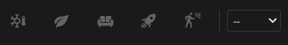

When the select duration is open:

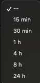

With the option to enter manually the duration:

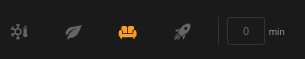

### When a timed preset is active

When a timed preset is active:
- The duration selector is replaced by the remaining time display (e.g., "45 min" or "2h30" for durations over 1 hour)
- A cancel button (X) appears next to the remaining time
- Click the cancel button to immediately cancel the timed preset and return to the previous preset

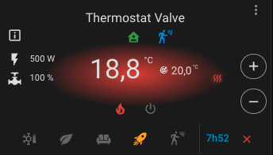

### Configuration options

- **disable_timed_preset**: Set to `true` to completely hide the timed preset feature
- **use_manual_duration_input**: Set to `true` to use a free input field (in minutes) instead of the preset duration selector

Example with timed preset using selector (default):
```yaml
type: custom:versatile-thermostat-ui-card
entity: climate.living_room
```

Example with manual duration input:
```yaml
type: custom:versatile-thermostat-ui-card
entity: climate.living_room
use_manual_duration_input: true
```

Example with timed preset disabled:
```yaml
type: custom:versatile-thermostat-ui-card
entity: climate.living_room
disable_timed_preset: true
```

## Modify preset temperatures

The **preset temperature modification** panel lets you edit the target temperatures of each preset directly from the card, without opening Home Assistant's entity settings.

To enable it, add `allow_preset_modification: true` to your card configuration:

```yaml
type: custom:versatile-thermostat-ui-card
entity: climate.living_room
allow_preset_modification: true
```

When the option is enabled, a collapsible panel appears at the bottom of the card, allowing you to view and edit the preset temperatures for each HVAC mode and presence combination (heat, heat away, cool, cool away).

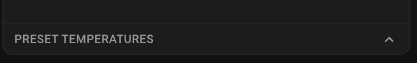

click to expand the panel:

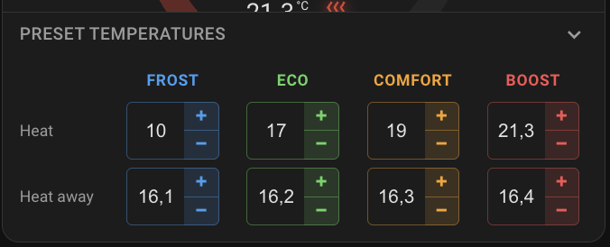

### How it works

A collapsible bar is permanently attached to the bottom of the card (or the popup for the Gunmalmg theme). A header row shows the title and a **chevron** indicator:
- **▲** (chevron up) — panel is **closed**
- **▼** (chevron down) — panel is **open**

Click the header to toggle the panel open or closed.

### The temperature table

When open, the panel shows a table with up to **4 rows** and **4 columns**:

**Columns** — one per preset, color-coded for quick identification:
| Column | Color |
|--------|-------|
| Frost  | 🔵 Blue |
| Eco    | 🟢 Green |
| Comfort | 🟠 Orange |
| Boost  | 🔴 Red |

**Rows** — one per HVAC mode × presence combination (only rows that have at least one matching entity are displayed):
| Row | Description |
|-----|-------------|
| Heat | Target temperature when heating and occupant is present |
| Heat away | Target temperature when heating and occupant is absent |
| Cool | Target temperature when cooling and occupant is present |
| Cool away | Target temperature when cooling and occupant is absent |

> The Cool and Cool away rows are shown only if the thermostat supports cooling mode (entities named `*_ac_temp` or `*_ac_away_temp` are detected automatically).

### The stepper input

Each cell contains a compact **stepper** widget:

```
┌───────┬──┐
│ 19.5  │+ │
│       ├──┤
│       │− │
└───────┴──┘
```

- The **input field** shows the current temperature and can be edited directly.
- The **+** button (top) increments the value by one `step` (as defined by the entity).
- The **−** button (bottom) decrements the value by one `step`.
- Values are automatically clamped to the entity's `min` / `max` bounds.
- The buttons are tinted with the column's color for easy identification.

### Entity discovery

The panel automatically discovers all `number` entities with `device_class: temperature` that belong to the same device as the configured climate entity. No manual configuration is needed.

## Regulation chart

The **regulation chart** displays the historical regulation data of your thermostat on a dual-axis time chart. It helps you understand how the thermostat is regulating the temperature over time.

To enable it, add `show_regulation_chart: true` to your card configuration:

```yaml
type: custom:versatile-thermostat-ui-card
entity: climate.living_room
show_regulation_chart: true
```

A collapsible panel labelled **"Graphique de régulation"** appears at the bottom of the card (or the popup for the Gunmalmg theme). Click the header to open or close it.

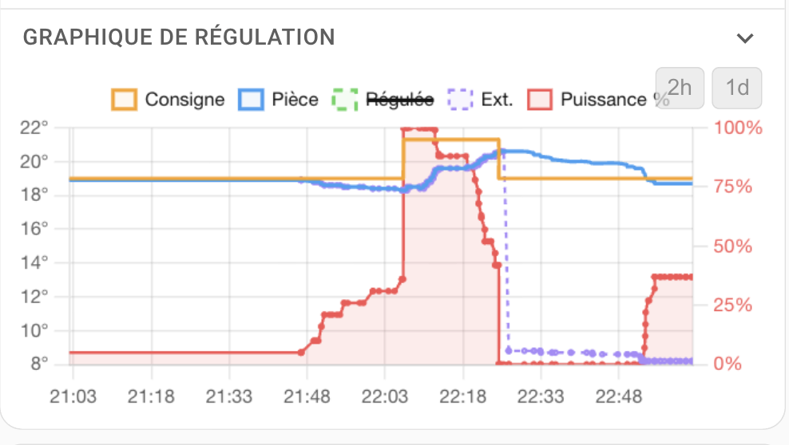

### Displayed curves

The chart shows up to 5 curves over the last 24 hours. Curves are automatically hidden if their data is not available for the entity:

| Curve | Colour | Y axis | Description |
|-------|--------|--------|-------------|
| Consigne | 🟠 Orange | Left (°) | Target temperature (`temperature`) |
| Pièce | 🔵 Blue | Left (°) | Room temperature (`current_temperature`) |
| Régulée | 🟢 Green dashed | Left (°) | Regulated target temperature (over-climate TPI only) |
| Ext. | 🟣 Purple dashed | Left (°) | Outdoor temperature (`specific_states.ext_current_temperature`) |
| Puissance % | 🔴 Red filled | Right (%) | Heating power percentage (`power_percent`) |

The chart loads the full **24 hours** of history from the Home Assistant history API on first open. Live data points are then appended automatically as the thermostat state changes.

### Navigation

The chart opens by default zoomed on the **last 2 hours**. Two buttons are available at the top-right of the chart:

| Button | Action |
|--------|--------|
| **2h** | Zoom back to the last 2 hours (default view) |
| **1d** | Show the full 24-hour history |

You can also:
- **Scroll** the mouse wheel to zoom in/out on the time axis
- **Drag** left or right to pan through time
- Use a **pinch gesture** on touch screens to zoom

### Configuration

| Name | Type | Default | Description |
|------|------|---------|-------------|
| show_regulation_chart | boolean | **Optional** | `true` to enable the regulation chart panel |

> **Note:** The regulation chart is available in all themes. For the Gunmalmg theme, it appears inside the popup.

---

# Informations on current state

## Display some messages
When the mode or the preset or the target temperature has been changed due to special event (window detection, motion detection, power, ...) an information icon like  or 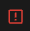 is diplayed on the left bar.
Click on it and you will see why your VTherm is not in the requested state.

Example when the setpoint has been changed due to motion detection:

  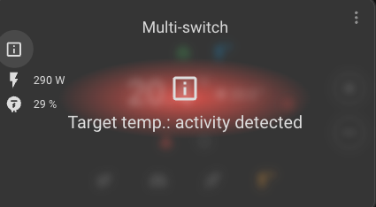

Another example when the VTherm has been turned off by the auto-start/stop feature:

  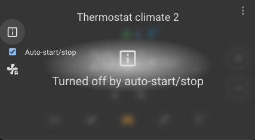

When overpowering and shedding is activated and the setpooint has been set with the `power_temp` configuration value:

  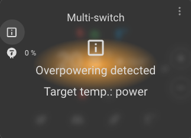

If the VTherm has been turned off by the auto-start/stop feature:

  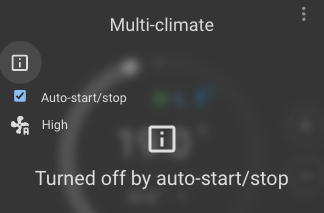

When the timed preset is active:

  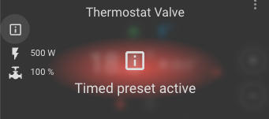

When a heating failure is detected:

  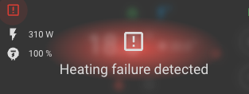

See more informations on heating failure detection in the _VTherm_ documentation.

Just click another time to the information icon to close the information popup.

## Update of underlying scheduled
When the update of the underlying has been delayed due to temporal filter (see on VTherm documentation), then an update icon will be displayed in the left bar:

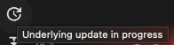

## Safety state
The safety state informs you that one off the temperature sensors configured in your VTherm don't have send any new temperature to your VTherm. When this happens, there is a risk of overheating and then the VTherm turns into the safety state. This is displayed like that:

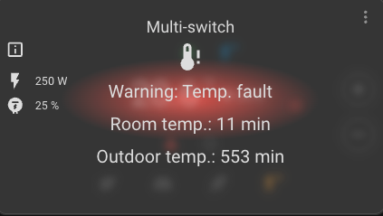

The safety mode has been activated because the outdoor temperature sensor's last measurement was 554 minutes ago (and the room temperature was 13 min ago which is more normal).

More informations on the safety mode can be found [here](https://github.com/jmcollin78/versatile_thermostat/blob/main/documentation/en/troubleshooting.md#why-is-my-versatile-thermostat-going-into-safety-mode).

## Icons used

| Icon  | Meaning  |
|---|---|
|   | Some information messages are available. Click on it to see it  |
|   | Some warning informations messages are available. Click on it to see it  |
|  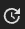 | The underlying device's update has been delayed. See temporal filter on VTherm documentation  |
|   | The presence is detected  |
|  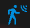 | The activity (ie motion) is detected  |
|   | The window is detected as open. Click on it to bypass the window detection  |
|   | The window bypass is active. Click on it to cancel the bypass |
|   | An overpowering detection has been done. The VTherm is in shedding mode |
|   | The VTherm has been turned off by the auto-start/stop feature. |
|   | The target temperature (setpoint)  |
|    | The underlying device is cooling (`hvac_action` is cooling)  |
|    | The underlying device is idle and the mode is Cool (`hvac_action` is idle and the `hvac_mode` is Cool)  |
|    | The underlying device is heating (`hvac_action` is heating)  |
|  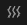  | The underlying device is idle and the mode is Heat (`hvac_action` is idle and the `hvac_mode` is Heat)  |

Example:

  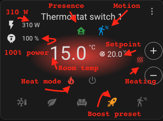

## Help wanted!

It would be awsome if you help me to translate this card to other languages.

Create a PR, the Translation is done in json files checkout the en translation [here](https://github.com/KartoffelToby/versatile-thermostat-ui-card/blob/master/src/localize/languages/en.json)

Please add your language to this list as well while you are making your PR. Put it in alphabetical order and according to [ISO 639-1](https://en.wikipedia.org/wiki/List_of_ISO_639-1_codes).

## Translations

[INLANG Editor](https://inlang.com/editor/github.com/KartoffelToby/versatile-thermostat-ui-card)

What we have so far:
- en - Reference 
- bg
- ca
- cn
- cs
- da
- de
- el
- es
- fi
- fr - Reference
- hu
- it
- nl
- no
- pl
- pt
- ro
- ru
- sv
- sl
- sk
- tr
- uk

## Support me
<a href="https://www.buymeacoffee.com/jmcollin78"></a>

***

[versatile_thermostat]: https://github.com/jmcollin78/versatile_thermostat
[buymecoffee]: https://www.buymeacoffee.com/jmcollin78
[buymecoffeebadge]: https://img.shields.io/badge/Buy%20me%20a%20beer-%245-orange?style=for-the-badge&logo=buy-me-a-beer
[commits-shield]: https://img.shields.io/github/commit-activity/y/jmcollin78/versatile-thermostat-ui-card.svg?style=for-the-badge
[commits]: https://github.com/jmcollin78/versatile-thermostat-ui-card/commits/master
[hacs]: https://github.com/custom-components/hacs
[hacs_badge]: https://img.shields.io/badge/HACS-Custom-41BDF5.svg?style=for-the-badge
[forum-shield]: https://img.shields.io/badge/community-forum-brightgreen.svg?style=for-the-badge
[forum]: https://community.home-assistant.io/
[license-shield]: https://img.shields.io/github/license/jmcollin78/versatile-thermostat-ui-card.svg?style=for-the-badge
[maintenance-shield]: https://img.shields.io/badge/maintainer-Joakim%20Sørensen%20%40ludeeus-blue.svg?style=for-the-badge
[releases-shield]: https://img.shields.io/github/release/jmcollin78/versatile-thermostat-ui-card.svg?style=for-the-badge
[releases]: https://github.com/jmcollin78/versatile-thermostat-ui-card/releases
